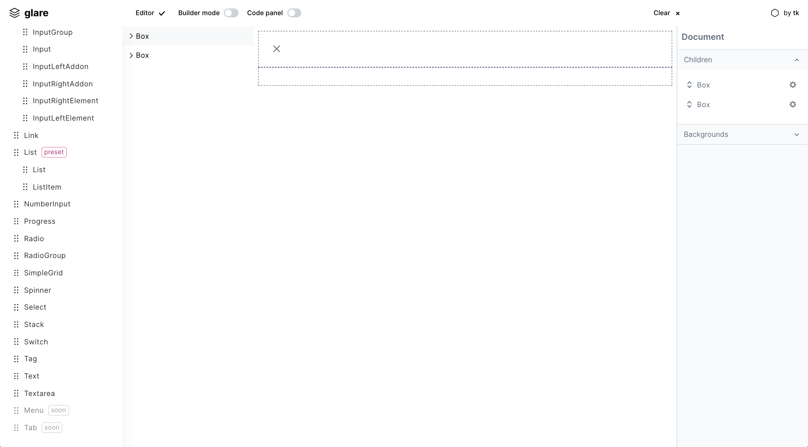

[](https://github.com/glareui/glare)
[](https://github.com/glareui/glare)

# Glare

Visual Editor Framework



### How to use?

```
import { Editor, InspectorProvider, Inspector, TreeView } from "@glare/editor";

const BasicEditor = () => (
  <Flex h="calc(100vh - 3rem)">
    <TreeView />
    <Box bg="white" flex={1} position="relative">
      <Editor />
    </Box>
    <Box
      maxH="calc(100vh - 3rem)"
      flex="0 0 15rem"
      bg="#f7fafc"
      overflowY="auto"
      overflowX="visible">
      <InspectorProvider>
        <Inspector />
      </InspectorProvider>
    </Box>
  </Flex>
)
```

### Development

Clone this repo, run Yarn and start development app

    yarn app:start

### Install

    ** NOTE - PACKAGE NOT YET RELEASED **

    yarn add @glare/core

# Usage

#### Credits

This is forked version of OpenChakra, so big thanks to them!

- [OpenChakra](https://github.com/premieroctet/openchakra/)

### Is it any good?

[Yes.](http://news.ycombinator.com/item?id=3067434)
